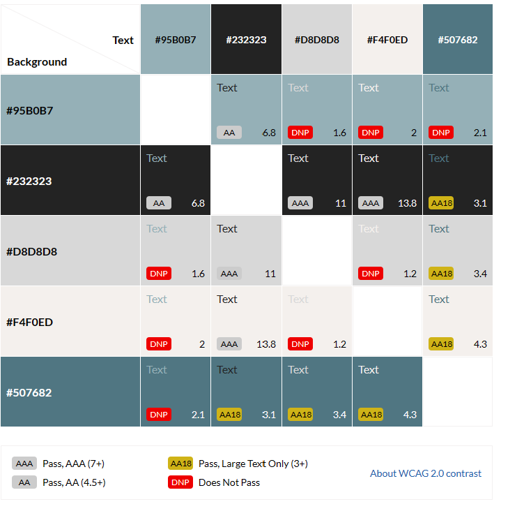
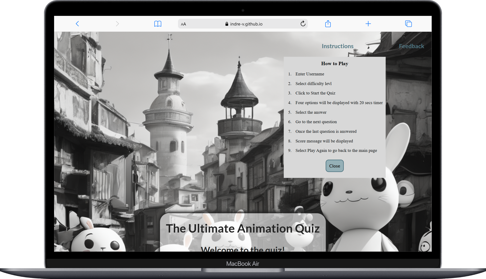

# The Ultimate Animation Quiz

[Link to Animation Quiz Website](https://indre-v.github.io/animation-quiz/)

The Ultimate Animation quiz offers an opportunity to test knowledge at three levels in animation including cartoons. 

Every question has 20 second timer.

Players have the option provide feedback to website creators.

[Contents](#contents)
  * [User Goals](#user-goals)
  * [User Stories](#user-stories)
  * [Website Goals and Objectives](#website-goals-and-objectives)
  * [Wireframes](#wireframes)
  * [Design Choices](#design-choices)
    + [Typography](#typography)
    + [Colour Scheme](#colour-scheme)
    + [Images](#images)
    + [Responsiveness](#responsiveness)
- [Features](#features)
  * [Existing Features](#existing-features)
    + [Header](#header)
      - [Intructions](#intructions)
      - [Feedback](#feedback)
    + [Landing View](#landing-view)
    + [Question View](#question-view)
    + [Final Score View](#final-score-view)
    + [Footer](#footer)
  * [Future Enhancements](#future-enhancements)
- [Technologies Used](#technologies-used)
  * [Languages](#languages)
  * [Libraries & Framework](#libraries---framework)
  * [Tools](#tools)
- [Testing](#testing)
  * [Bugs Fixed](#bugs-fixed)
  * [Responsiveness Tests](#responsiveness-tests)
  * [Code Validation](#code-validation)
    + [HTML](#html)
    + [CSS](#css)
    + [Javascript](#javascript)
  * [User Story Testing](#user-story-testing)
  * [Feature Testing](#feature-testing)
  * [Accessibility Testing](#accessibility-testing)
  * [Lighthouse Testing](#lighthouse-testing)
  * [Browser Testing](#browser-testing)
- [Deployment](#deployment)
  * [To deploy the project](#to-deploy-the-project)
  * [To fork the project](#to-fork-the-project)
  * [To clone the project](#to-clone-the-project)
- [Credits](#credits)

## User Goals

* User friendly navigation.
* Non distracting background.
* Opportunity to provide feedback.
* Clear instructions written in plain English.
* Relevant questions in the quiz.
* Fair scoring system.

## User Stories 

* As a user, I want my knowledge to be challenged.
* As a user, I want to be able to test my knowledge at different levels.
* As a user, I want to receive immediate feedback on my quiz answers, including the correct answer.
* As a user, I want to able to be able to share my results on social media.  
* As a user, I want the instructions to be clear, concise and easily accessible. 
* As a user, I want navigation to be intuitive.
* As a user, I want the score system to be transparent.
* As a user, I want to be able to use website on range of devices.
* As a user, I want to be able to easily contact content creators for feedback or changes.
* As a user, I want the content to be accessible for anyone with diverse needs.

## Website Goals and Objectives

* Provide entertainment and enjoyment for users whilst testing their knowledge.
* Offer useful and accurate content that entices user to spend time on website.
* Invite users to provide feeback.
* Integrate accessibility features with high accessibility rating and diverse user audience. 
* Increase overall website traffic by increasing rankings on search engine.
* Invite users to share results on Social media to imcrease user interaction.

[Back to top](#contents)

## Wireframes

Wireframes were designed using Balsamiq tool. Following best practices, mobile version was designed first, then tablet and lastly the laptop view. There is some slight deviations from wireframes in the live version of the quiz. It is one page website to enhance the logical flow. 

 [Mobile Wireframes](docs/mobile-wireframes.pdf "Mobile Wireframes")

 [Tablet Wireframes](docs/tablet-wireframes.pdf "Tablet Wireframes")

 [Dektop Wireframes](docs/desktop-wireframes.pdf "Desktop Wireframes")

 [Back to top](#contents)

 ## Design Choices

### Typography

The font family chosen for The Ultimate Animation quiz was [Lato]("https://fonts.google.com/specimen/Lato?query=lato"). It is a sans-serif font with a rounded appearance and a modern feel. Lato also has a clean and easy-to-read style, making it suitable for both print and web design.

### Colour Scheme

The color scheme chosen based on the background image. All the colours are cool toned to match the black and white image theme. 

| Primary Colors CSS HEX             |                                                                                |
| ---------------------------------- | ------------------------------------------------------------------------------ |
|     --blue: #95B0B7;               | Button and timer background color, footer hover color.                         |
|     --dark-gray: #232323;          | Font color for the quiz.                                                       |
|     --light-gray: #d8d8d8;         | Timer border color, support open background color.                             |
|     --light-cream: #f4f0ed;        | Button hover color, timer shadow color.                                        |
|     --dark-blue: #507682;          | Font color for support section, border color for buttons, active button color. |
| Other Colors CSS Hex               |                                                                                |
|     --wrong-answer-red: #ff3333;   | Color for wrong answer button.                                                 |
|     --right-answer-green: #51BF83; | Color for correct answer button, color for check icon.                         |
|     --pale-gray: #ffffff9c;        | Overlay color for the quiz container.                                          |

### Images

Background image is generated by [Gencraft]("https://gencraft.com/"). It displays cartoon characters with cool grey colors in order not to distract from the content of the quiz questions. 

### Responsiveness

My website will be responsive to different layouts depending on the size of the viewport have been included in the CSS media queries. This allows visitors to experience the website as I intended on device types and screen sizes. The breakpoints I am using are from Bootstrap.

[Back to top](#contents)

# Features

Layout is easy to use and adheres to best practices in formatting and styling. The site's flow and appearance will be recognizable to users. The quiz design is visually appealing with intuitive interface, making it easy for the user to navigate through questions and options.

## Existing Features

### Header

This webpage has a header consistent across all screen sizes. It contains Intstructions and Feddback sections on the right. 
both can be open at the same time. 

#### Intructions

When clicked on instructions open in a window with aclose button on the bottom. 

<b>Instructions View</b>

 

#### Feedback

<b>Feedback Form</b>

 

#### Feedback Confirmation

Provides the user with aknowledgement and option to return back to the game after the form has been submitted. 

<b>Feedback Confirmation Page</b>

 

[Back to top](#contents)

### Landing View

<b>Landing View Large Screen</b>

 

_Small Screen Devices_ 

<b>Landing View Small Screen</b>

 

[Back to top](#contents)

### Question View

[Back to top](#contents)

### Final Score View

[Back to top](#contents)

### Footer

<b>Footer All Screen Sizes</b>

 

[Back to top](#contents)

### 404 Page

In a scenario where the link may be broken, 404 page provides the option to return  to the main page.

<b>404 Page Screenshot</b>

 

[Back to top](#contents)

## Future Enhancements

* Multiple player option.
* Online scoreboard that includes all players.
* Option to store the progress and return to the quiz at a later time, allowing to finish it at user's pace and not lose any of the questions already completed.
* Broaden range of animation topics such as principles of animation, software tools, and industry best practices.
* Provide  hints or additional resources for challenging questions.
* Time-adjustable quiz where player can select a time limit for each question, all question or have no limitless time to complete.

[Back to top](#contents)

# Technologies Used

## Languages

- [HTML](https://developer.mozilla.org/en-US/docs/Glossary/HTML5 "HTML")
- [CSS](https://developer.mozilla.org/en-US/docs/Web/CSS "CSS")
- [JS](https://developer.mozilla.org/en-US/docs/Web/JavaScript "JS")

## Libraries & Framework

- [Google Fonts](https://fonts.google.com/ "Google Fonts")
- [Font Awesome library](https://fontawesome.com/ "Font Awesome")

## Tools

* [Codeanywhere](https://app.codeanywhere.com/ "Codeanywhere")
* [GitHub](https://github.com/ "GitHub")
* [Gitpod](https://www.gitpod.io/#get-started "Gitpod")
* [Balsamiq](https://balsamiq.com/wireframes/ "Balsamiq")
* [W3C HTML Validation Service](https://validator.w3.org/ "W3C HTML")
* [W3C CSS Validation Service](https://jigsaw.w3.org/css-validator/ "W3C CSS")
* [JSHint](https://jshint.com/ "JSHint")
* [TOC Generator](https://ecotrust-canada.github.io/markdown-toc/ "TOC Generator")
* [Am I Responsive](https://ui.dev/amiresponsive "Am I responsive")
* [Responsive Design Checker](https://responsivedesignchecker.com/ "Responsive Design Checker")
* [WAVE Accessibility Tool](https://wave.webaim.org/ "WAVE Accessibility Tool")
* [Image Resize](https://www.iloveimg.com/ "iLoveIMG")
* [Color Contrast Accessibility Validator](https://color.a11y.com/ "Color Contrast Accessibility Validator")

[Back to top](#contents)

# Testing

## Bugs Fixed

[Back to top](#contents)

## Responsiveness Tests

[Back to top](#contents)

## Code Validation

### HTML

### CSS

### Javascript

[Back to top](#contents)

## User Story Testing

[Back to top](#contents)

## Feature Testing

[Back to top](#contents)

## Accessibility Testing

[Back to top](#contents)

## Lighthouse Testing

[Back to top](#contents)

## Browser Testing

[Back to top](#contents)

# Deployment

## To deploy the project

The Ultimate Animation Quiz was deployed early in the process to GitHub pages via the following steps:

- Navigate to the repository on GitHub and click on **Settings**.

- In the side navigation and select **Pages**.

- In the **None** dropdown and choose **Main**.

- Click on the **Save** button.

- The website is now live at `https://indre-v.github.io/animation-quiz/`.

_Any changes required to the website, they can be made, committed and pushed to GitHub._

[Back to top](#contents)

## To fork the project

Forking the GitHub repository allows you to create a duplicate of a local repository. This is done so that modifications to the copy can be performed without compromising the original repository.

- Log in to GitHub.
- Locate the repository.
- Click to open it.
- The fork button is located on the right side of the repository menu.
- To copy the repository to your GitHub account, click the button.

## To clone the project

- Log in to GitHub.
- Navigate to the main page of the repository and click Code.
- Copy the URL for the repository.
- Open your local IDE.
- Change the current working directory to the location where you want the cloned directory.
- Type git clone, and then paste the URL you copied earlier.
- Press Enter to create your local clone.

[Back to top](#contents)

# Credits

- Feedback, advice and support:

  - [Simen Daehlin](https://github.com/Eventyret "Simen Daehlin")

- Code inspiration and learning content:

* [Flexbox and Grid Tutorials by Kevin Powell](https://www.youtube.com/user/KepowOb "Kevin Powell")
* [Project Portfolio-2 channel on Slack](https://slack.com/intl/en-ie/ "Slack")

- [Love Maths Project](https://codeinstitute.net "Love Maths Project")
- [W3C Schools](https://www.w3schools.com/ "W3C Schools")
- [StackOverflow](https://stackoverflow.com/ "StackOverflow")
- [CodePen](https://codepen.io/pen/ "CodePen")

* Visual content:

  - [Coolors](https://coolors.co/ "Coolors")
  - [Contrast Grid](https://contrast-grid.eightshapes.com/ "Contrast Grid")

* Images:

[Back to top](#contents)

